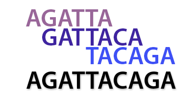

# Genome Sequencing

## ⚽The Goal
You are working as a computer scientist in a laboratory seeking to sequence the genome. A DNA sequence is represented by a character string (of A, C, T and G) such as GATTACA. The problem is that biologists are only able to extract sub-sequences of the complete sequence. Your role is to combine these partial sub-sequences to recover the original sequence.

In this exercise you are asked to calculate the length of the shortest sequence that contains all the sub-sequences of the input data.

## ✔Rules
You are given N sub-sequences and you must return the length of the shortest sequence that contains all the sub-sequences. There may be several sequences of the same minimum length and which fit the requirement. We are not asking you to list these, but only to return their length.

Note that there is always a solution. One can indeed simply concatenate all the sub-sequences to obtain a valid sequence. But by nesting (even partially) the sub-sequences, it is generally possible to obtain a shorter sequence (see the example).

## 🗒Example
For example, you have three sub-sequences AGATTA, GATTACA, and TACAGA. The sequence AGATTACAGA is the shortest sequence that contains all the sub-sequences.

Note that in this example, there are other sequences which contain all of the sub-sequences such as TACAGATTACAGATTA.. However, we prefer the former because it is shorter (10 characters instead of 16).

 
 
Example  AGATTACAGA contains the sub-sequences AGATTA, GATTACA, and TACAGA.
         
         
         
         
         	Game Input

    Input

        Line 1: The number N of sub-sequences
        
        N following lines: one sub-sequence by line, represented by a string of characters from A, C, T and G. Each sub-sequence ranges from 1 to maximum 10 characters long.
        

    Output

        The length of the shortest sequence containing all the sub-sequences.
        Constraints
        0 < N < 6
        Examples

    Input

        2
        AAC
        CCTT

    Output

        6

    Input

        3
        AGATTA
        GATTACA
        TACAGA

    Output

        10

    Input

        3
        TT
        AA
        ACT

    Output

        5        