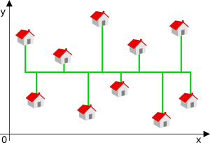
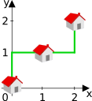
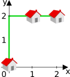

# Network Cabling

## ⚽The Goal
An internet operator plans to connect a business park to the optical fiber network. The area to be covered is large and the operator is asking you to write a program that will calculate the minimum length of optical fiber cable required to connect all buildings.

## ✔Rules
For the implementation of the works, the operator has technical constraints whereby it is forced to proceed in the following manner:
A main cable will cross through the park from the West to the East (from the position x of the most westerly building to the position x of the most easterly building).

For each building, a dedicated cable will connect from the building to the main cable by a minimal path (North or South), as shown in the following example:

 

	In this example, the green lines represent the cables. 
The minimum length will therefore depend on the position of the main cable.

## 📑Game Input

### Input
* **Line 1**: The number N of buildings that need to be connected to the optical fiber network
* **On the N following lines**: The coordinates x and y of the buildings

### Output
The minimum length L of cable required to connect all of the buildings. In other words, the length of the main cable plus the length of the cables dedicated to all the buildings.

* **Note**: the buildings with the same position x should not in any case share the same dedicated cable.
0 < N ≤ 100000
0 ≤ L ≤ 263
-230 ≤ x ≤ 230
-230 ≤ y ≤ 230
Example 1

 

### Input
3
0 0
1 1
2 2

### Output
4
Example 2

 

### Input
3
1 2
0 0
2 2

### Output
4